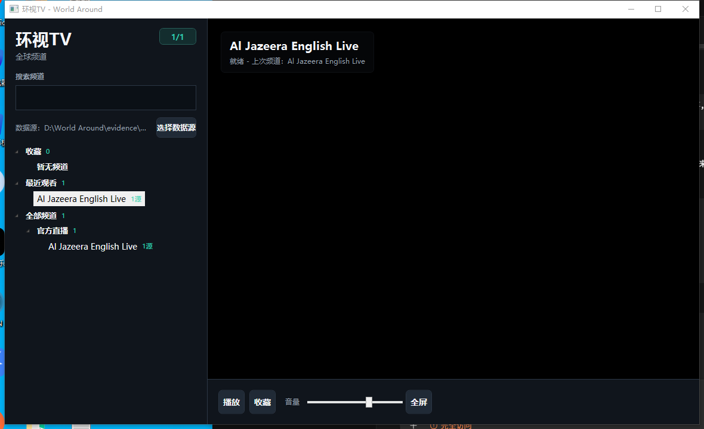
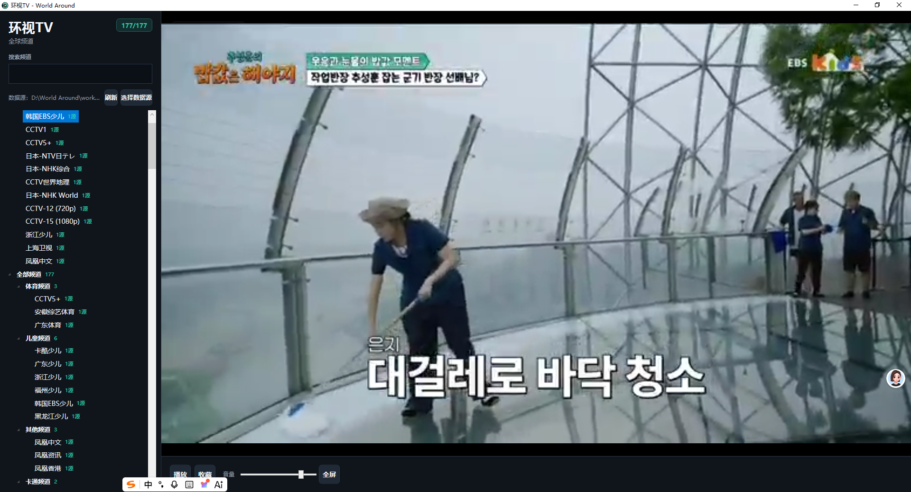
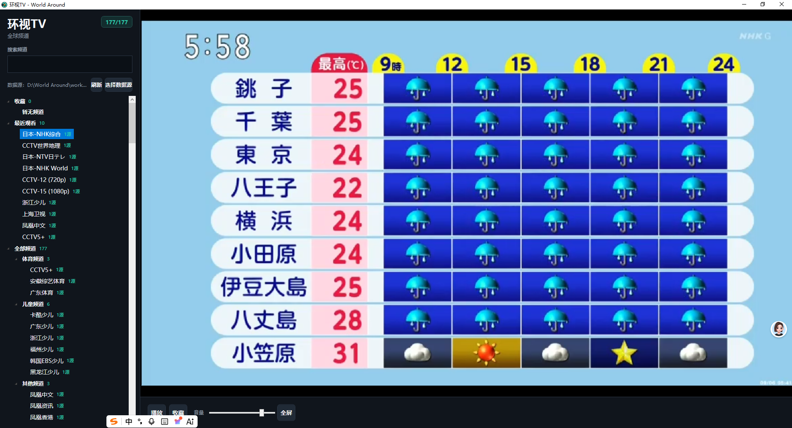
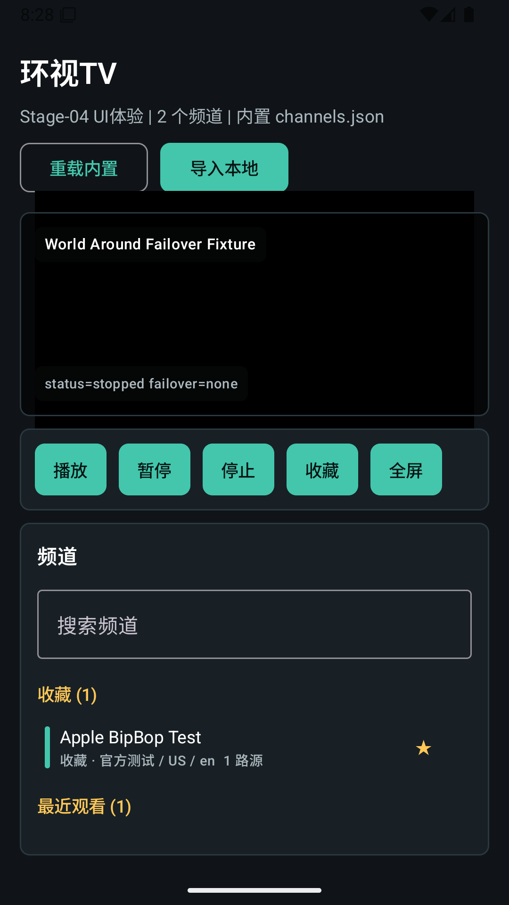

# World Around / 环视TV — Self-Hosted IPTV Player for Windows & Android

**A self-hosted global IPTV player: open it and watch, switch channels fast, auto-failover to backup streams when a source dies, and a clean TV-style UI. Windows first, Android second, and a separate Go-based source steward that cleans and probes your own playlists.**

World Around / 环视TV 是一个自用的全球 IPTV 播放器：打开就能看、换台要快、源坏了自动切备用、界面干净不恶心。Windows 版优先，Android 版随后，另有一个独立的 Go 源维护工具（Source Steward）负责清洗和探测你自己配置的播放源。

> **Repository status.** This repository is a **portfolio / showcase** for the World Around project: documentation and screenshots of the R1 builds. **No binaries and no source code are published here.** This is a self-hosted tool for the publisher's own use (UI is Simplified Chinese), and the source stewards are fed by the user's own playlists — publishing those playlists or the binaries would leak stream data and defeat the point of self-hosting. Every capability claim below is what the app actually does on a real device.
>
> 本仓库是 World Around（环视TV）项目的**作品展示**：R1 构建的文档与截图。**不放任何二进制与源码**。这是发布者自用的工具（UI 为简体中文），播放源由用户自己配置——公开播放列表或二进制会泄露流数据、违背自托管初衷。下方所有能力声明均为真机实测。

## What it does / 功能

- **M3U / M3U8 import** — local files and remote URLs; channel groups, search, favorites, recents, fullscreen, remembers the last channel.
- **Auto-failover** — when a stream fails, playback switches to the next backup stream for the same channel automatically; only when all streams fail does the channel show as unavailable.
- **TV-style UI** — dark theme, large channel list, keyboard-operable, clean fullscreen that never covers the player.
- **Source Steward (Go)** — reads a `sources.txt` you configure, pulls public / self-owned M3Us, parses, dedupes, probes (HTTP HEAD/GET + ffprobe), scores health, and exports a clean channel library (`clean.m3u` + `channels.json` + a report).
- **No crawler, no source marketplace** — the player only reads playlists you provide; the steward only touches sources you configure.

功能：本地/远程 M3U、M3U8 导入；频道列表、分组、搜索；收藏、最近观看；全屏播放；记住上次频道；播放失败自动切备用源；简洁电视软件界面（深色、大字号、键盘可操作）。Source Steward 读取你配置的 sources.txt，拉取公开/自有 M3U，解析、去重、探测（HTTP + ffprobe）、打分，导出干净频道库与报告。播放器不内置爬虫、不做源市场。

## Compliance boundary / 合规边界

```text
- 不内置直播源 / no bundled streams
- 不内置成人源抓取 / no adult-source scraping
- 不自动发现敏感内容 / no automatic sensitive-content discovery
- 不提供内容分发服务 / no content distribution
- 只支持用户本地/自有/公开合法源导入 / only user-supplied legal sources
```

The player never aggregates, hosts, or redistributes content — you bring your own playlists. 播放器不聚合、不托管、不分发内容——播放源由你自行提供。

## Screenshots / 截图

*(R1 acceptance captures — live playback of real channels — 简体中文界面 / Simplified Chinese UI)*

| Windows · Home | Windows · Live (Korea EBS) | Windows · Live (Japan NHK) | Android · Home |
|---|---|---|---|
|  |  |  |  |


## Architecture / 技术栈

| Component | Stack |
|---|---|
| Windows player | C# / WPF + LibVLCSharp (VideoLAN.LibVLC.Windows) |
| Android player | Kotlin + AndroidX Media3 / ExoPlayer |
| Source Steward | Go + SQLite + ffprobe, exports clean.m3u / channels.json / report.md |
| Data format | `channels.json` primary, `clean.m3u` fallback |

## Status / 状态

R1 complete (2026-07/08): Windows player (import/list/play/favorite/fullscreen/failover) and Android MVP (HLS/M3U8 playback, channel tree, favorites, fullscreen) both verified on real devices. The project is a self-hosted family TV tool; R2 ideas (EPG/XMLTV, channel logos, smart classification, TV-optimized Android) are tracked but not scheduled.

R1 已完成（2026-07/08）：Windows 播放器（导入/列表/播放/收藏/全屏/自动切源）与 Android MVP（HLS/M3U8 播放、频道树、收藏、全屏）均真机验证通过。R2 规划（EPG/XMLTV、频道 logo、智能分类、Android TV 优化）已记录，暂无排期。

## License / 许可

Evaluation license — see [LICENSE](LICENSE). This repository is a showcase; **commercial redistribution of any artifact is not permitted**.

## Disclaimer / 免责

World Around plays the playlists you provide. The legality of any stream source is your responsibility — the tool neither discovers, aggregates nor distributes content. Always use sources you are authorized to use. 环视TV 只播放你提供的播放列表；任何流来源的合法性由你自行负责——本工具不发现、不聚合、不分发内容。